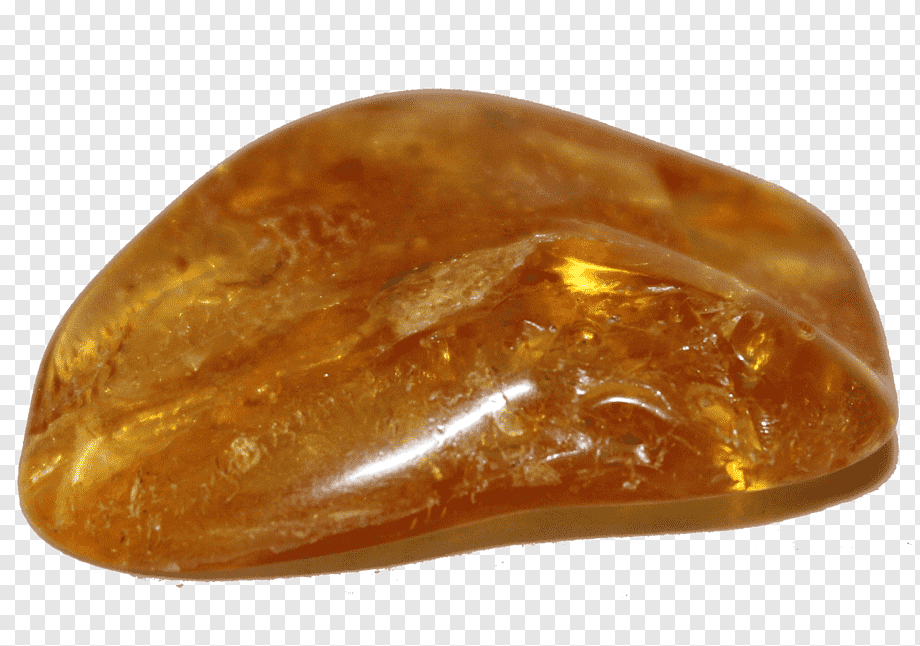

    

    

<h1 align="middle"> 루비네 집사 </h1>

 Spring Security를 적용한 심부름 센터 백엔드 서버 만들기

<a href="https://www.notion.so/8fa710b180e24ba4bc22e80dd86f88e7">팀 노션</a> 
<a href="https://www.youtube.com/watch?v=Gx3Uzo4izNk">시연영상</a>

 

## 💬 서비스 소개

> 23.01.16 - 23.01.25

"간단한 도움이 필요할 때, 심부름 서비스 루비네 집사"

학습 기간 동안 갈고 닦아온 스프링 프레임워크를 비롯한 여러 기술들을 활용하여 만든 팀원들과 함께 소통할 수 있는 공간입니다.

간단한 도움이 필요한 구매자가 도움 글을 게시하면 도움을 줄 헬퍼가 이를 확인한 후 매칭 신청을 합니다.

구매자가 매칭 신청을 확인한 후 이를 수락,거절하여 매칭 결과를 표시합니다.

매칭이 수락된 경우, 도움 글의 상태는 심부름 중으로 변하고 심부름이 마친 후 심부름 끝으로 변합니다.

관리자는 구매자와 헬퍼의 프로필을 관리 할 수 있으며, 구매자가 심부름 요청을 하면 관리자는 승인 및 거절을 할 수 있고, 헬퍼와 구매자가 부적절한 행동을 할 경우 구매자 및 헬퍼 권한을 해제할 수 있습니다.

* 회원가입 / 로그인 / 로그아웃 / 회원탈퇴 / JWT / Spring Security
* 프로필 조회 / 수정
* 전체 게시글 작성 / 수정 / 삭제 / 조회 / 내가 쓴 게시글 조회
* 매칭글 작성 / 수정 / 삭제 / 조회 
* 헬퍼 작성 / 수정 / 삭제 / 수락 / 거절
* 전체 회원 조회 / 고객 회원 조회 / 헬퍼 권한 등록 및 삭제
* 예외 처리

 

## 🤝 삼성과 아이들 멤버

|                       팀장                        |                        팀원                         |                           팀원                           |                       팀원                        |                        팀원                         |
|:-----------------------------------------------:|:-------------------------------------------------:|:------------------------------------------------------:|:-----------------------------------------------:|:-------------------------------------------------:|
|   |  |          |  |  |
|        [성준혁](https://github.com/zoo5607)        |         [김주성](https://github.com/karlema)         |            [성루비](https://github.com/quipu1)            |         [배지호](https://github.com/2Luda)         |      [김태웅](https://github.com/ultramancode)       |

 

## ⚙ 기술 스택

##### [ Back-end ]

    
    
    
    
    

 

##### [ Cowork tools ]

    
    
    
    

 

## 📃 API 명세

<a href="https://www.notion.so/7184e013e92c4574a891ac5013488508?v=782c6ff6279b4bc9a9bae01e2d246a42">Notion API 명세</a>

## 📌 개념 모델링

## 📌 ERD

